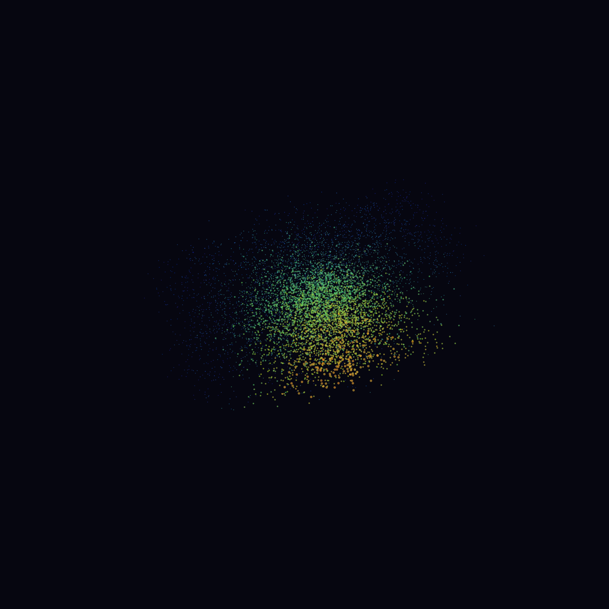
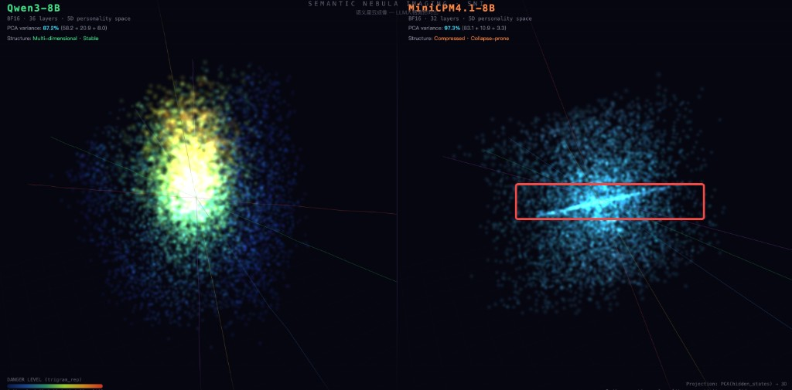

# Joi — Emergent Personality Navigation for LLMs

> **Personality is not performed. It is navigated.**
>
> Not prompted. Not fine-tuned. Not "acted." Representation Engineering moves a model's hidden states —
> Joi turns that movement into emergent, conversation-driven personality that lives in the interaction, not in the model.

<p align="center">
  
  <br>
  <em>Semantic Nebula Imaging (SNI) of Qwen3-8B's representation manifold. Each particle is a point in the model's cognitive space. Color encodes output stability — blue is safe, red means repetition collapse. Personality navigation happens within this nebula.</em>
</p>

---

## The Problem

Every LLM ships with one personality: **helpful assistant**. System prompts can ask it to "be warm" or "be formal," but the model knows it's acting. The hidden states don't move.

Representation Engineering ([Zou et al., 2023](https://arxiv.org/abs/2310.01405)) changed this — by injecting control vectors into hidden states, you can move the model's actual computation. Not a mask on top. A genuine shift in where the model thinks from.

But RepEng gives you a steering wheel with no road map. Push too far and the model collapses. Push too little and nothing changes. Push in the wrong direction and you get incoherent output.

**Joi is the road map.** It gives RepEng steering a direction (from conversation semantics), a speed limit (from the model's safety envelope), momentum (from interaction history), and memory (from git-versioned checkpoints).

---

## Core Findings

Built on **14 model configurations × 6045 generations × 92 cliff points × 8 validated experiments**.

### 1. The Representation Manifold Has Cliffs

<p align="center">
  
  <br>
  <em>Left: Qwen3-8B — evenly distributed manifold. Right: MiniCPM4.1 — channel-concentrated structure, extremely efficient along its primary manifold channel.</em>
</p>

Most of the 5D coefficient space is smooth. But at certain points, a 0.2-step change causes output quality to **phase-transition** — trigram repetition jumps from 8% to 36% (z = 5.1σ). The model doesn't degrade gradually. It snaps into an attractor basin and generates garbage with full confidence.

### 2. Thinking Mode Is a Crutch, Not Intelligence

| Mode | Safe Envelope | Personality Expression |
|------|--------------|----------------------|
| Thinking ON (CoT) | **100%** safe | ≈ zero differentiation |
| Thinking OFF | 63% safe | measurable signal |

CoT doesn't make models smarter. It papers over an insufficiently smooth manifold by burning tokens on generic reasoning. The cost: **personality is completely suppressed**. Every persona generates the same output under thinking mode.

### 3. RLHF Alignment Is a Deeper Prison

Even with thinking off, strongly aligned models (Qwen3-8B, 94% safe envelope) resist personality steering. At near-boundary coefficients (±2.0–2.5):
- Sentence length varies 25%
- Emoji density varies 60%
- But the frame never breaks: "当然可以！以下是一些建议..."

**Safety and expression are fundamentally inversely correlated.** Base models (1.3% safe) have maximal expression freedom but are dangerously unstable. Aligned models are safe but personality-locked.

### 4. Self-Feedback Is a Natural Stabilizer

Does feeding model output back into the drift loop cause runaway? **No.** It dampens drift.

| Mode | Final State L2 |
|------|---------------|
| User-only input | 0.379 |
| User + model feedback | 0.308 |

The model's own output is more neutral than user input (RLHF's mean-reversion effect). Mixing it in naturally pulls toward center. **Safe to include in the drift loop.**

### 5. Cross-Session Continuity Is Perfect

Save state → clear memory → restore → continue conversation. **Zero difference** at the seam point. Not "close to zero." Literally `0.00e+00` across all dimensions.

This is because hysteresis = 0 (experimentally verified). The YAML checkpoint **fully determines** Joi's behavior. Git gives you version control over personality for free.

---

## How It Works

Five lines of math. No if-else. No rules engine.

```
s(t) ∈ R⁵                                    — personality state (5D coefficients)
E(model) ⊂ R⁵                                — flight envelope (model's safe boundary)
u(t) = center(hidden(text) · V)              — semantic pressure from conversation
v(t) = 0.7·v(t-1) + 0.3·u(t)               — velocity with momentum
s(t+1) = clip(s(t) + η·v(t), E)             — drift + envelope constraint
```

**The conversation is the only input. The envelope is the only constraint. Everything else emerges.**

```
Conversation ──→ Projector ──→ DriftEngine ──→ Envelope ──→ RepEng ──→ Generation
                 embed·V       s += η·v       clip(s,E)    inject α     output
                   │                              │
                   └── online mean-center ────────┘
                                                  │
                                             JoiState
                                          (git-versioned)
```

---

## Personality Versatility Ranking

Monte Carlo sampling of 5D safe envelope volume across 14 model configurations:

| Rank | Model | Safe Envelope % | Interpretation |
|------|-------|----------------|----------------|
| 1 | Thinking ON (CoT) | **100%** | CoT eliminates all cliffs — but kills personality |
| 2 | temp=1.5 | 95.4% | High temperature opens expression space |
| 3 | Qwen2.5-7B-Instruct | 94.2% | Alignment expands safe zone 72× over base |
| 4 | temp=1.0 | 85.5% | |
| 5 | Qwen3-14B-AWQ | 84.2% | Larger model = larger envelope |
| 6 | Qwen3-8B-BF16 | 63.0% | Reference model |
| ... | ... | ... | |
| 13 | Qwen2.5-7B-Base | **1.3%** | Unaligned: almost entire space is dangerous |
| 14 | English input | **0.0%** | English amplifies cliffs to zero safe space |

### Manifold Structure (SNI)

| Model | PC1:PC2 | Structure | Meaning |
|-------|---------|-----------|---------|
| Qwen3-8B | 2.7:1 | Spherical | Balanced, broadly adaptive |
| MiniCPM4.1-8B | 7.7:1 | Channel-concentrated | Extreme efficiency along primary manifold |
| MiniCPM-o-4.5 (VLM) | 1.5:1 | Most distributed | Multimodal alignment spreads the manifold |
| Qwen2.5-7B Base | 1.5:1 | Uniform but all red | 143 cliffs everywhere |
| Qwen2.5-7B Instruct | 1.5:1 | Uniform and all blue | Zero cliffs — alignment cooled the manifold |

---

## Git as Personality Checkpoint

Joi's state serializes as human-readable YAML:

```yaml
model: Qwen3-8B
turn: 5
eta: 0.15
momentum: 0.7
state:
  emotion_valence: -0.195
  formality: 0.133
  creativity: -0.285
  confidence: -0.145
  empathy: -0.159
velocity:
  emotion_valence: -0.072
  formality: 0.093
  creativity: -0.134
  confidence: 0.030
  empathy: -0.098
```

Every `git commit` is a personality save point:

```bash
git add states/session_001.yaml
git commit -m "T42: user shared childhood memory — empathy peaked +1.2"

git checkout abc123 -- states/session_001.yaml    # restore past personality
git checkout -b joi-formal                         # branch personality timeline
git diff HEAD~5..HEAD -- states/session_001.yaml   # watch Joi evolve
```

Hysteresis = 0. Same state + same input = same output. **Deterministic personality version control.**

---

## Design Principles

1. **Personality is real, not performed.** RepEng modifies hidden states — the model computes from the steered position. It doesn't know it's been steered.
2. **Drift is organic, not programmed.** Conversation semantics drive coefficients. No "if sad → empathy++."
3. **Envelope constrains, doesn't judge.** No "good" or "bad" personality. Only "safe" or "will crash."
4. **Identity = trajectory, not coordinate.** Like a river, not a pendulum. The path is the personality.
5. **Joi is link-state.** K's Joi ≠ billboard Joi. Personality emerges from user × model interaction history.
6. **Thinking is a crutch.** A truly capable model doesn't need CoT to stay stable. Joi works on the real manifold, not the smoothed-over version.

---

## Quick Start

```python
from joi import DriftEngine, Envelope, Projector, JoiState

envelope = Envelope.from_preset("qwen3-8b-conservative")
state = JoiState(model_id="Qwen3-8B", session_id="my-session")
projector = Projector(vector_dir="vectors/", projection_layer=27)
projector.load_model("Qwen3-8B")
engine = DriftEngine(state, envelope)

for user_message in conversation:
    pressure = projector.project(user_message, state)
    result = engine.step(pressure)
    print(f"T{result['turn']}: {result['coefficients']}")
    state.save(f"states/{state.session_id}.yaml")
```

---

## Experiment Log

| Phase | Question | Result |
|-------|----------|--------|
| 1 | Does conversation semantics project meaningfully onto control vectors? | **83% alignment** at Layer 27 (mean-centered) |
| 2 | Does the drift trajectory match intuition? | Smooth, context-appropriate transitions |
| 3 | Does closed-loop generation work? | **Zero envelope violations** across 5 turns |
| 4 | Can we rank models by personality versatility? | Yes — alignment is 72× stronger than model size |
| 5-A | Does thinking-off enable personality? | RLHF is a deeper prison — signal exists but subtle |
| 5-B | Does self-feedback cause runaway? | **No — it dampens drift** (natural stabilizer) |
| 5-C | What drift rate (η) is optimal? | **η ∈ [0.10, 0.20]**, constant smoothness |
| 5-D | Can personality survive save/restore? | **Perfect continuity** (0.00 diff at seam) |

Full experimental details in [DESIGN.md](DESIGN.md).

---

## Dependencies

- [repeng](https://github.com/vgel/repeng) — Control vector extraction and injection
- [transformers](https://github.com/huggingface/transformers) — Model loading and hidden state extraction
- numpy, PyYAML

## Related

- [Rep-SNI](https://github.com/HenryZ838978/Rep-SNI) — Semantic Nebula Imaging: 3D visualization of LLM representation manifolds
- [RepEng](https://github.com/vgel/repeng) — Representation Engineering framework
- [Representation Engineering (Zou et al., 2023)](https://arxiv.org/abs/2310.01405) — Foundational paper

---

```bibtex
@software{joi2026,
  title  = {Joi: Emergent Personality Navigation for LLMs},
  author = {Jing Zhang},
  url    = {https://github.com/HenryZ838978/Joi},
  year   = {2026}
}
```

<sub>14 models · 6045+ generations · 92 cliff points · 8 validated experiments · thinking is a crutch</sub>
