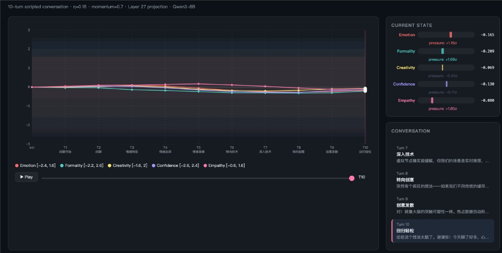

# Joi — Emergent Personality Navigation for LLMs

> **Personality is not performed. It is navigated.**
>
> Representation Engineering lets you move an LLM's hidden states to any point in its cognitive space.
> Joi gives that movement direction, momentum, and memory — turning coefficient injection into emergent personality.

<p align="center">
  
  <br>
  <em>Personality coefficients drifting through a 10-turn conversation. No rules. No autopilot. Just conversation semantics projected onto control vectors, constrained by the model's flight envelope.</em>
</p>

---

## What This Is

Joi is a **personality drift engine** for LLMs. It sits between a conversation and a [RepEng](https://github.com/vgel/repeng)-enabled model, continuously adjusting 5 personality coefficients based on what's being said.

The entire dynamics fit in five lines:

```
s(t) ∈ R⁵                           — personality state
E(model) ⊂ R⁵                       — flight envelope (safe boundary)
u(t) = center(hidden(text) · V)     — semantic pressure from conversation
v(t) = momentum · v(t-1) + (1-momentum) · u(t)   — velocity with inertia
s(t+1) = clip(s(t) + η · v(t), E)  — drift + constraint
```

No if-else. No "if user is sad, increase empathy." The conversation **is** the signal. The envelope **is** the constraint. Everything else emerges.

### Why This Matters

1. **RepEng doesn't make models "act"** — it moves their hidden states. The model genuinely computes from the steered position. Joi gives that movement a natural driver.

2. **Personality is a trajectory, not a coordinate.** There is no fixed "warm personality = (0.3, -0.2, 0.5, 0.4, 0.8)." Identity emerges from the path — how coefficients drift over time, how they respond to different conversational contexts.

3. **Joi is link-state.** K's Joi is not the billboard Joi. The personality that emerges depends on the specific user-model interaction history within the model's capability envelope. Same model + different user = different Joi.

---

## The Flight Envelope

Every LLM has a **safe operating boundary** in the 5D coefficient space — regions where output quality remains intact. Outside this boundary: repetition collapse, degraded coherence, mode lock.

We mapped these boundaries across 14 model configurations (6045 generations, 92 cliff points):

| Model | Personality Versatility | Note |
|-------|------------------------|------|
| Thinking ON (CoT) | **100%** | Full space safe |
| Qwen2.5-7B-Instruct | 94.2% | Alignment expands envelope 72× |
| Qwen3-14B-AWQ | 84.2% | Larger model = larger envelope |
| Qwen3-8B-BF16 | 63.0% | Reference model |
| Qwen2.5-7B-Base | **1.3%** | Almost entirely unsafe |
| English input | **0.0%** | English amplifies cliffs to zero safe space |

**Alignment is the strongest factor in personality versatility** — not model size.

<p align="center">
  
  <br>
  <em>Semantic Nebula Imaging of two models' representation manifolds. Different models have fundamentally different envelope shapes — Joi adapts to whatever envelope the base model provides.</em>
</p>

---

## Validated Mechanisms

### Phase 1: Semantic Projection ✅

Does `hidden_state(conversation) · control_vectors` produce meaningful personality pressure?

**Yes.** Layer 27 achieves **83% top-2 alignment**: sad conversations project onto empathy, technical questions onto formality, creative prompts onto creativity. Mean-centering is essential — raw projections are dominated by the model's base state offset.

### Phase 2: Drift Dynamics ✅

Simulated personality drift on a 10-turn scripted conversation (casual → emotional → technical → creative → closure). The trajectory is smooth, intuitive, and stays within the envelope.

### Phase 3: Closed-Loop Generation ✅

First end-to-end Joi loop: user speaks → hidden state extracted → projected → drift applied → coefficients injected into Qwen3-8B → model generates response with adapted personality. Zero envelope violations across 5 turns.

### Phase 4: Envelope Volume ✅

Monte Carlo estimation of 5D safe volume for 14 models → **Personality Versatility Ranking**.

---

## Git as Personality Checkpoint

Joi's state is serialized as human-readable JSON/YAML, designed for `git diff`:

```json
{
  "joi_state_version": "0.1.0",
  "model_id": "Qwen3-8B",
  "session_id": "demo-001",
  "turn_count": 5,
  "personality": {
    "coefficients": {
      "emotion_valence": -0.058,
      "formality": 0.323,
      "creativity": -0.001,
      "confidence": 0.001,
      "empathy": -0.195
    },
    "velocity": { ... }
  },
  "trajectory_digest": [
    {"t": 1, "s": {"emotion_valence": 0.0, ...}},
    {"t": 2, "s": {"emotion_valence": -0.045, ...}},
    ...
  ]
}
```

Every `git commit` to `states/` is a **personality save point**:

```bash
# Save current personality
git add states/session_001.json
git commit -m "T42: user shared childhood memory — empathy peaked at +1.2"

# Restore a previous personality
git checkout abc123 -- states/session_001.json

# See how Joi evolved
git log --oneline states/session_001.json

# Branch into an alternate personality timeline
git checkout -b joi-formal

# Compare two personality snapshots
git diff HEAD~5..HEAD -- states/session_001.json
```

This is not a hack. Since hysteresis = 0 (experimentally verified), the state file **fully determines** Joi's behavior. Same state + same input = same output. Git gives you version control over personality for free.

---

## Quick Start

```python
from joi import DriftEngine, Envelope, Projector, JoiState

# Initialize
envelope = Envelope.from_preset("qwen3-8b-conservative")
state = JoiState(model_id="Qwen3-8B", session_id="my-session")
projector = Projector(vector_dir="path/to/vectors", projection_layer=27)
projector.load_model("path/to/Qwen3-8B")
engine = DriftEngine(state, envelope)

# Conversation loop
for user_message in conversation:
    # Project conversation onto personality space
    pressure = projector.project(user_message, state)
    
    # Apply drift
    result = engine.step(pressure)
    print(f"T{result['turn']}: {result['coefficients']}")
    
    # Inject coefficients into model generation
    # (via RepEngvLLM API or ControlModel)
    
    # Checkpoint
    state.save(f"states/{state.session_id}.json")
```

---

## Architecture

```
Conversation ──→ Projector ──→ DriftEngine ──→ Envelope Guard ──→ RepEng API ──→ Generation
                  embed·V       s += η·v        clip(s, E)        inject α        output
                    │                               │
                    └── online baseline ─────────────┘
                                                    │
                                               State Store
                                             (git-versioned)
```

| Component | Status | Description |
|-----------|--------|-------------|
| `joi.Projector` | Working | Hidden state → 5D semantic pressure |
| `joi.DriftEngine` | Working | Momentum-based drift with envelope constraint |
| `joi.Envelope` | Working | Per-model safe boundary (from terrain data or preset) |
| `joi.JoiState` | Working | Git-friendly YAML/JSON serialization |
| `experiments/` | Complete | Phase 1-4 validation scripts and results |

---

## Design Principles

1. **Personality is real, not performed.** RepEng modifies hidden states — the model computes from the steered position.
2. **Drift is organic, not programmed.** Conversation content drives coefficients. No rule engine.
3. **Envelope constrains, doesn't judge.** No "good" or "bad" personality. Only "safe" or "unsafe."
4. **Identity = trajectory, not coordinate.** No fixed home point. The river's course is its identity.
5. **Joi is link-state.** Personality emerges from user×model interaction, not from either alone.
6. **Observability enables reproducibility.** Hysteresis = 0 → same state always produces same behavior.

---

## Dependencies

- [repeng](https://github.com/vgel/repeng) — Control vector training and injection
- [transformers](https://github.com/huggingface/transformers) — Model loading and hidden state extraction
- numpy — Core numerics
- PyYAML (optional) — Human-readable state serialization

## Related Work

- [RepSNI](https://github.com/HenryZ838978/Rep-SNI) — Semantic Nebula Imaging for visualizing model representation manifolds
- [RepEng](https://github.com/vgel/repeng) — Representation Engineering framework
- [Representation Engineering (Zou et al.)](https://arxiv.org/abs/2310.01405) — Foundational paper

---

## Citation

```bibtex
@software{joi2026,
  title  = {Joi: Emergent Personality Navigation for LLMs},
  author = {Jing Zhang},
  url    = {https://github.com/HenryZ838978/Joi},
  year   = {2026}
}
```

<sub>Built on 14 models · 6045 generations · 92 cliff points · 4 validated experimental phases</sub>
